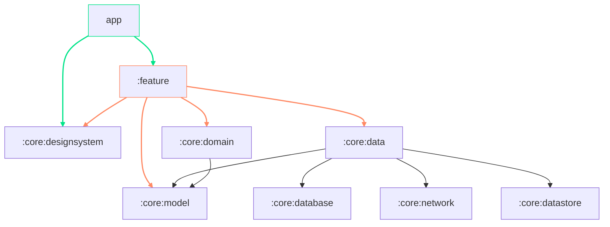

<a href="https://play.google.com/store/apps/details?id=com.google.samples.apps.nowinandroid"></a> <a>&nbsp;&nbsp;</a>
<a href="https://strong-marlin-f95.notion.site/SRS-3098c52bd8da4fc6aa41f6cba6b2f47f?pvs=4"></a>


## 하루 만다라트
> 💡 **만다라트와 투두의 만남으로 가지고있는 꿈과 목표를 구체화하고 달성하세요.**

### Feature
#### 온/오프라인 지원
- 최초 로그인 이후 온라인, 오프라인 환경 지원
- 데이터 자동 동기화
#### 만다라트
- 9 X 9 만다라트,  목표 계획, 시각화
- 최종 목표 예시 제공
- 최종목표, 핵심목표, 세부목표로 구분, 달성률 표출
- 만다라트 확대, 축소, 제스처를 통한 전환
#### 하루 만다라트
- 하루마다 8개의 할일 그룹 관리
- 날짜별, 그룹별 투두 완료 상태 표출
- 미완료한 투두 시간에 알림 표출
#### 기록
- 작성한 투두 기록 github 잔디 형태로 표출
- 투두를 작성한 총 일수 표출


### ScreenShots
| |  | |
|-|-|-|-|
|  |  | || 

## Module




## Development
### Required
| Name | Version |
| --- | --- |
| IDE |   *```Android Studio Hedgehog```* | 
| Kotlin |   *```1.9.10```* | 
| MinSdk  |   *```26```* | 
| TargetSdk  |   *```34```* | 


### Libraries
| Name | Version |
| --- | --- |
| Coroutines | *```1.7.3```* |
| Dagger-Hilt | *```2.48.1```* |
| Room | *```2.6.1```* |
| DataStore  | *```1.0.0```* |
| Serialization| *```1.6.0```* |
| Supabase | *```2.1.4```* |
| Logger | *```2.2.0```* |


> [!NOTE]
> 사용한 라이브러리 세부정보는 [libs.versions.toml](https://github.com/haru-mandal-art/haru-mandalart/blob/dev/gradle/libs.versions.toml) 를 참고해 주세요.

## Team

|                                        Android                                         |                                              Android                                               |
|:-------------------------------------------------------------------------------------:|:-------------------------------------------------------------------------------------------------:|
| [](https://github.com/coldDelight) | [](https://github.com/2blue-99) | 
| <a href="https://github.com/coldDelight">김찬희                                          |     <a href="https://github.com/2blue-99">  이푸름                                                 | 
